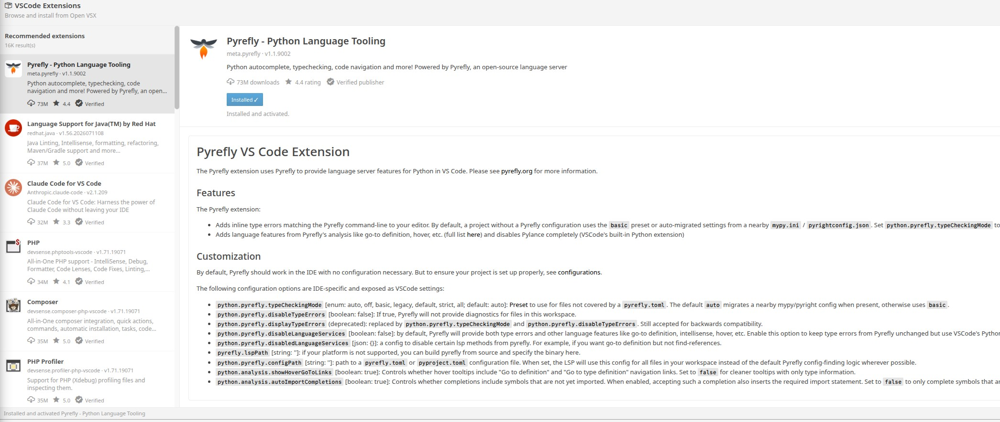

# Pulsar VSCode Compatibility Layer

The intention of this plug-in is to allow VSCode extensions to be installed in
Pulsar, and behave like they were Pulsar native. It does that by mapping
VSCode's APIs to Pulsar's ones (not **Atom** - this plug-in uses some specific
APIs that were added in Pulsar) and then adapting activation code so that such
extensions can work. Each extension will be installed in the same directory as
Pulsar's packages, so they are essentially **indistinguishable** from Pulsar's
"normal" packages - but they still need to `vscode-compat` extension to be
installed and active otherwise they won't work.

There are a couple changes that one needs to be aware: VSCode extensions run in
a webworker, so they don't block the main thread. That means, if an extension is
misbehaving, you will get a spike in your CPU or your editor consuming a lot of
memory, but the editor itself might not block, freeze, or appear to be slowing
down. In Pulsar, packages run in the main thread - the same as the UI,
autocomplete, and everything else. This means that the editor _will freeze_ if
something goes wrong - but it also means we can open up the door for some very
cool [experiments in the future](#future-experiments).

## WARNING - AI CODE

This project is written with **a lot** of AI tools. Multiple tools are being
used in this translation layer - Claude and Codex are the main ones, but also
some local models and other approaches. I tried, and failed, multiple times to
write this translation layer manuall - the VSCode API is extensive and there are
**a lot** of undocumented behaviors, internal structure, and other unreliable
information that some extensions use. The worst part is that some of these
extensions are not open-source, which translated to me trying to read minified
extension code, trying to understand what mapped to what, and having to
implement all this behavior by hand, just to reload the extension and see it
fail in different places.

If you are uncomfortable with AI code, be warned. While I don't consider this
project fully "vibe-coded", more than 90% of this code is AI generated. I wish
that it didn't - I really do. But it is what it is.

## Installing VSCode extensions

Use the built-in extension browser command:

```text
pulsar-vscode-compat:browse-extensions
```



The browser installs from Open VSX. After installation it tries to load and
activate the generated Pulsar package immediately with Pulsar's package manager.
A reload prompt is only shown if immediate activation fails.
Platform-specific Open VSX artifacts are selected when available.

The compatibility layer tries really hard to map the extension activation hooks
into Pulsar ones - for example, opening up a Python source code should trigger
the activation if that's what the extension defined; triggering up a command
also works (but the command's name might be different from VSCode, for now at
least). For all purposes, the VSCode extension is installed as if it's a
**Pulsar** package - so you can uninstall it from the Pulsar's package manager,
you will see the extension code under the same directory as Pulsar's ones
(usually `~/.pulsar/packages`), and you can see the README, and the configs
available, under Pulsar's settings panel - for all effects and purposes, as soon
as it is installed, a VSCode extension **is** a Pulsar package.

Deactivating (and reloading) the VSCode Compat, while you have VSCode extensions
installed, will probably crash them. We might, in the future, offer a warning
that the compatibility layer is not present, but installing a VSCode extension
under Pulsar, then disabling/uninstalling the compat layer and making the VSCode
extension _still works_ won't ever be supported.

## Architecture

This package provides two pieces:

1. A `vscode` API implementation under `lib/vscode.js`.
2. A VSIX wrapper/installer that converts a VSCode extension into a Pulsar package.

Wrapped VSCode extensions are installed as normal Pulsar packages named like:

```text
vscode-<publisher>-<name>
```

Each generated wrapper contains the original VSCode extension under:

```text
extension/
```

and a generated Pulsar entry point under:

```text
lib/main.js
```

The generated wrapper also creates a local package shim:

```text
node_modules/vscode/index.js
```

That shim is intentionally local to the generated wrapper package. There is no global `require('vscode')` hook in Pulsar core. The generated wrapper first activates `pulsar-vscode-compat`, then loads the original VSCode extension. If `pulsar-vscode-compat` is missing, disabled, or fails to activate, the generated wrapper logs a warning and does not load the VSCode extension.

## What maps to what

### Extension activation

VSCode extension activation maps to Pulsar package activation.

The generated wrapper translates common VSCode `activationEvents` into native Pulsar lazy activation metadata:

- `onCommand:<id>` becomes `activationCommands` on `atom-workspace`.
- `onLanguage:<id>` becomes Pulsar grammar activation hooks such as `source.ts:root-scope-used`.
- VSCode 1.74+ implicit activation is inferred from `contributes.commands` and `contributes.languages` when `activationEvents` is omitted.
- `*`, `onStartupFinished`, and unsupported events such as `workspaceContains`, `onView`, `onUri`, `onDebug`, and `onTaskType` fall back to normal startup activation rather than being silently missed.

Once Pulsar activates the wrapper package, its `activate(state)` does this:

1. Calls `atom.packages.activatePackage('pulsar-vscode-compat')`.
2. Loads `pulsar-vscode-compat/lib/vscode.js`.
3. Requires the original extension main file from `extension/`.
4. Constructs an `ExtensionContext`.
5. Calls the original extension's `activate(context)`.

`deactivate()` calls the original extension's `deactivate()` when present, then disposes the compatibility `ExtensionContext`.

### Commands

- `registerCommand` maps to `atom.commands.add('atom-workspace', ...)`.
- `registerTextEditorCommand` maps to `atom.commands.add('atom-text-editor', ...)`.
- `executeCommand` first calls a registered VSCode command callback directly when one exists.
- If no VSCode callback is registered, it dispatches an Atom/Pulsar command with `atom.commands.dispatch(...)`.
- `vscode.executeCompletionItemProvider` is specially routed to the internal completion provider registry.

The wrapper reads `contributes.commands` from the original VSCode `package.json` and uses the VSCode `category`, `title`, and `description` as Pulsar command metadata. This gives the command palette human-readable labels like `Calva: Connect to a Running REPL Server` while preserving the raw command id, such as `calva.connect`, for command execution.

### Workspace and documents

- Text documents wrap Pulsar `TextEditor`/buffer objects via `TextDocument`.
- `openTextDocument` maps file URIs and paths to `atom.workspace.createItemForURI(...)` so documents can be opened without necessarily creating a visible pane.
- `showTextDocument` maps to opening/revealing a Pulsar editor pane through `atom.workspace.open(...)`.
- `textDocuments` maps to `atom.workspace.getTextEditors()`.
- `workspaceFolders` maps to `atom.project.getPaths()`.
- `getWorkspaceFolder(uri)` finds the owning Pulsar project path.
- `applyEdit` applies VSCode `WorkspaceEdit` text edits to Pulsar buffers and handles simple create/delete/rename file operations.
- `getConfiguration(section)` maps VSCode configuration keys onto Pulsar config keys. For wrapped extensions, contributed configuration from a single VSCode section is shown as package-level settings in Pulsar's package UI, while `workspace.getConfiguration(section)` still reads/writes the corresponding wrapper setting. Older nested `wrapperPackage.section.key` values are still read as a fallback.
- Configuration change events report whether a requested VSCode setting was affected.
- `workspace.fs` maps to Node `fs.promises` for the `file:` scheme: `stat`, `readDirectory`, `createDirectory`, `readFile`, `writeFile`, `delete`, `rename`, and `copy`.
- VSCode-style `FileSystemError` factories are available.
- `registerFileSystemProvider` registers custom URI schemes for `workspace.fs` operations.
- `registerTextDocumentContentProvider` supports virtual/read-only documents for custom schemes.
- `createFileSystemWatcher` uses Pulsar's global `atom.watchPath` when available and matches common VSCode glob patterns without an undeclared `minimatch` dependency.
- `findFiles` handles VSCode `RelativePattern` objects, exact relative paths, common glob patterns, exclusions, and `maxResults` without an undeclared `glob` dependency.

Document lifecycle events are best-effort translations from Pulsar editor/buffer events:

- `onDidOpenTextDocument`
- `onDidCloseTextDocument`
- `onDidChangeTextDocument`
- `onDidSaveTextDocument`
- `onWillSaveTextDocument`

Workspace folder and file operation events are present, but mostly placeholders unless explicitly fired by implemented operations.

### Completion

VSCode:

```js
vscode.languages.registerCompletionItemProvider(selector, provider, ...triggerCharacters)
```

Pulsar mapping:

- Completion providers are converted into `autocomplete-plus` providers.
- `pulsar-vscode-compat` provides an `autocomplete.provider` service from `main.js`.
- The adapter lives in `lib/adapters/completion-adapter.js`.
- VSCode `CompletionItem` objects are converted to autocomplete-plus suggestions.
- Completion documentation is converted to Markdown/HTML suitable for Pulsar's completion UI.
- Completion prefixes, filtering, and item ranges are mapped to autocomplete-plus.
- `resolveCompletionItem` maps to autocomplete-plus detail resolution.
- Completion item commands are dispatched through Pulsar command dispatch after insertion.

Limitations:

- The mapping is approximate because VSCode completion and autocomplete-plus have different item models.
- Some VSCode insert text rules, snippets, commit characters, additional text edits,
  and complex insert/replace behavior may not behave exactly like VSCode.

### Hover

VSCode:

```js
vscode.languages.registerHoverProvider(selector, provider)
```

Pulsar mapping:

- Hover providers are exposed through Pulsar's `hover` service.
- VSCode hover contents and ranges are converted to Pulsar's hover provider format.

This is implemented in:

```text
lib/adapters/hover-adapter.js
lib/service/hover.js
```

### Diagnostics / linting

VSCode:

```js
vscode.languages.createDiagnosticCollection(name)
vscode.languages.getDiagnostics(uri?)
```

Pulsar mapping:

- `DiagnosticCollection` stores diagnostics internally.
- If the `linter-indie` service is available, diagnostics are published through a Linter indie provider named `VSCode Compatibility Layer`.
- Without `linter-indie`, diagnostics remain available through the compatibility API but are not shown as native lint messages.

### Definitions, declarations, implementations, type definitions, references, and symbols

VSCode:

```js
registerDefinitionProvider
registerDeclarationProvider
registerImplementationProvider
registerTypeDefinitionProvider
registerReferenceProvider / registerReferencesProvider
registerDocumentSymbolProvider
registerWorkspaceSymbolProvider
```

Pulsar mapping:

- These are adapted to Pulsar's `symbol.provider` service.
- `main.js` provides `symbol.provider` from `languages._symbolProviders`.
- Definition-like providers are wrapped as symbol providers that call the corresponding VSCode provider method and convert returned `Location`/`LocationLink` objects into symbols that Pulsar's symbols UI can open.
- Document symbols and workspace symbols similarly map to symbols-view provider shapes.

Implemented in:

```text
lib/adapters/definition-adapter.js
lib/namespaces/languages.js
```

Limitations:

- Pulsar's symbol provider model is not the same as VSCode's location provider model, so this is primarily useful for navigation, not a perfect API clone.

### Code actions

VSCode:

```js
vscode.languages.registerCodeActionsProvider(selector, provider, metadata)
```

Pulsar mapping:

- Providers are registered internally.
- A Pulsar command is added:

```text
vscode-compat:code-action
```

- A context menu item, `Code Actions`, is added to text editors.
- Invoking the command asks matching providers for actions at the current selection.
- Actions are shown with `showQuickPick`.
- Selected action edits are applied through `workspace.applyEdit`.
- Selected action commands are executed through `commands.executeCommand`.

Limitations:

- Diagnostics passed into the code-action context are currently empty.
- There is no lightbulb UI.

### Rename

VSCode:

```js
vscode.languages.registerRenameProvider(selector, provider)
```

Pulsar mapping:

- Providers are registered internally.
- A Pulsar command is added:

```text
vscode-compat:rename-symbol
```

- A context menu item, `Rename Symbol`, is added to text editors.
- The command prompts for a new name with `showInputBox`, calls `provideRenameEdits`, and applies the returned workspace edit.

Limitations:

- `prepareRename` support is not currently implemented.
- Rename UI is simple and command-based.

### Formatting

VSCode:

```js
registerDocumentFormattingEditProvider
registerDocumentRangeFormattingEditProvider
registerOnTypeFormattingEditProvider
```

Pulsar mapping:

- Formatting providers are stored internally.
- Formatting edits are translated into Pulsar buffer edits.
- Range formatting registers a command:

```text
vscode-compat:format-selection
```

- On-type formatting watches editor insertion events for trigger characters and applies edits.

Implemented in:

```text
lib/adapters/formatting-adapter.js
```

### Signature help

VSCode:

```js
vscode.languages.registerSignatureHelpProvider(selector, provider, metadata)
```

Pulsar mapping:

- Trigger characters are watched through Pulsar editor insertion events.
- Matching providers are called with a VSCode-like `SignatureHelpContext`.
- The selected signature is shown as an overlay decoration near the cursor.

Limitations:

- There is no full VSCode signature help widget.
- Manual invocation support is limited.

### Document highlights

VSCode:

```js
vscode.languages.registerDocumentHighlightProvider(selector, provider)
```

Pulsar mapping:

- Providers are called around cursor changes.
- Returned ranges are converted to Pulsar markers and decorated with `type: 'highlight'` and class `vscode-document-highlight`.

Implemented in:

```text
lib/adapters/highlight-adapter.js
```

### CodeLens

VSCode:

```js
vscode.languages.registerCodeLensProvider(selector, provider)
```

Pulsar mapping:

- Providers are observed per editor.
- Returned code lenses are rendered as custom block/line decorations in the editor.
- CodeLens commands dispatch through Pulsar command dispatch.

Implemented in:

```text
lib/adapters/codelens-adapter.js
```

### Inlay hints

VSCode:

```js
vscode.languages.registerInlayHintsProvider(selector, provider)
```

Pulsar mapping:

- Providers are observed per editor.
- Returned hints are rendered as viewport-aware callout decorations.
- Hints refresh as the editor and provider state changes.
- Rendering can be disabled with the **Show Inlay Hints** package setting.

Implemented in:

```text
lib/adapters/inlay-hint-adapter.js
```

### Folding ranges

VSCode:

```js
vscode.languages.registerFoldingRangeProvider(selector, provider)
```

Pulsar mapping:

- Providers can be registered and called.
- Pulsar's native folding model is not replaced.
- The implementation is currently mostly a placeholder for provider registration and future folding integration.

### Output channels

VSCode:

```js
vscode.window.createOutputChannel(name)
```

Pulsar mapping:

- Output channels are implemented as compatibility objects that collect/log output and can be shown in Pulsar UI.
- Log output channels are supported with VSCode-like log levels.

Implemented in:

```text
lib/types/output-channel.js
lib/namespaces/window.js
```

### Status bar

VSCode:

```js
vscode.window.createStatusBarItem(...)
vscode.window.setStatusBarMessage(...)
```

Pulsar mapping:

- `createStatusBarItem` maps to Pulsar's `status-bar` service when available.
- `setStatusBarMessage` creates a temporary left status bar tile.
- If the status bar service has not been consumed, status bar operations become harmless no-ops.

### Quick pick and input box

VSCode:

```js
vscode.window.showQuickPick(...)
vscode.window.createQuickPick()
vscode.window.showInputBox(...)
```

Pulsar mapping:

- `showQuickPick` maps to `atom-select-list` inside a modal panel.
- `createQuickPick` implements a VSCode-like QuickPick object with events such as `onDidChangeActive`, `onDidChangeSelection`, `onDidAccept`, and `onDidHide`.
- `showInputBox` maps to a mini `atom-text-editor` inside a modal panel.

Limitations:

- Multi-select and advanced QuickPick button behavior are only partially implemented.
- Styling and keyboard behavior are Pulsar-like rather than VSCode-identical.

### Notifications and messages

VSCode:

```js
showInformationMessage
showWarningMessage
showErrorMessage
```

Pulsar mapping:

- These map to `atom.notifications.addInfo`, `addWarning`, and `addError`.
- Button arguments are translated to Pulsar notification buttons and resolve the returned Promise with the clicked item.

### Terminals

VSCode:

```js
vscode.window.createTerminal(...)
```

Pulsar mapping:

- Terminals are represented as custom Pulsar pane items opened in the bottom dock.
- Pseudoterminals are supported through VSCode-like `pty.open`, `pty.handleInput`, `pty.close`, `onDidWrite`, `onDidClose`, and `onDidExit` patterns.
- Terminal output is rendered as text/HTML with limited ANSI support.
- Creating a terminal shows it immediately unless `hideFromUser` is requested.

This is intended to support extensions such as Calva that use pseudoterminals for REPL interaction/status output.

Limitations:

- This is not a full xterm.js terminal emulator.
- Shell-backed terminals are rudimentary compared with VSCode's integrated terminal.

### Text editors, selections, tabs, and decorations

VSCode:

```js
vscode.window.activeTextEditor
vscode.window.visibleTextEditors
vscode.window.onDidChangeTextEditorSelection
vscode.window.tabGroups
vscode.window.createTextEditorDecorationType(...)
editor.setDecorations(...)
```

Pulsar mapping:

- `TextEditor` wraps Pulsar `TextEditor` instances, with stable wrapper identity per underlying editor so extensions can compare `event.textEditor === vscode.window.activeTextEditor`.
- Active and visible editors are derived from `atom.workspace`, with fallbacks that remember the last active editor after focus moves into a webview.
- Selection changes are translated from Pulsar editor selection/cursor events into VSCode-shaped `onDidChangeTextEditorSelection` events.
- Basic selections, ranges, reveal, edit, insert, delete, and selection setters/getters are implemented.
- `tabGroups.all` and `activeTabGroup` are synthesized from Pulsar center panes.
- Text, text-diff, and compat webview tabs expose the corresponding VSCode tab input types.
- Decorations are translated to Pulsar markers/decorations and generated CSS where possible.

Limitations:

- Some VSCode decoration options have no Pulsar equivalent or are approximated with CSS.
- Overview ruler and minimap-specific features are not implemented.

### Tree views

VSCode:

```js
vscode.window.registerTreeDataProvider(...)
vscode.window.createTreeView(...)
```

Pulsar mapping:

- Tree data providers are exposed through Pulsar's `outline-view` service.
- Tree items are converted to nested outline entries with basic metadata and icons.

Limitations:

- Selection, reveal, checkbox, drag/drop, badges, commands, and advanced tree lifecycle
  behavior are incomplete or stubbed. Icon mapping is best-effort.

### Webviews

VSCode:

```js
vscode.window.createWebviewPanel(...)
```

Pulsar mapping:

- Webview panels are represented by custom Pulsar pane items containing sandboxed iframes.
- HTML assignment writes a temporary `file:` document instead of `srcdoc`, which avoids inherited Pulsar/Electron CSP blocking the extension's own nonce scripts.
- A webview API shim injects `acquireVsCodeApi()`, `postMessage`, `setState`, and `getState` before extension webview scripts run.
- `webview.onDidReceiveMessage` and `webview.postMessage` bridge messages between the extension and iframe.
- CSP handling is best-effort: the compat layer preserves extension CSP, injects nonce-aware theme/API scripts, and extends CSP where needed for local files/data fonts.
- `asWebviewUri` currently returns the input URI, while local-resource loading relies on the temporary `file:` document's same-origin access.
- Pulsar theme values are translated into VSCode-style CSS variables and body classes such as `vscode-dark`; active theme changes post live updates into existing webviews.
- `createWebviewPanel` honors `ViewColumn.Active`, `One`, `Beside`, and numeric columns by mapping them to center pane opens/splits.
- `panel.viewColumn` and `panel.reveal(...)` are implemented enough for extensions that manage editor columns.

Still no-op/stubbed webview APIs:

- `registerWebviewPanelSerializer`
- `registerWebviewViewProvider`

### Extension discovery

VSCode:

```js
vscode.extensions.getExtension(id)
vscode.extensions.all
```

Pulsar mapping:

- Loaded Pulsar packages are inspected.
- Wrapped VSCode packages expose metadata from their original `extension/package.json` and wrapper `package.json`.
- Installed but inactive wrappers can also be discovered.
- `activate()` waits for activation and resolves to the original extension's exports.
- A built-in `vscode.git` compatibility API is available.

### Environment

VSCode:

```js
vscode.env
```

Pulsar mapping:

- Clipboard maps to `atom.clipboard`.
- `openExternal` maps to Electron shell opening.
- `appName`, `appRoot`, session id, language, shell, URI scheme, and theme-ish values are synthesized from Pulsar/Electron where possible.
- Telemetry is disabled by default and telemetry APIs are no-op/logging style shims.

## Implemented / partially implemented / no-op status

### Implemented or useful today

These APIs have real behavior and are expected to be useful for compatibility work:

- Extension wrapping and activation shim.
- Open VSX browser and VSIX wrapper installation.
- `commands.registerCommand`, `registerTextEditorCommand`, `executeCommand`, `getCommands`.
- Command palette metadata from VSCode `contributes.commands`.
- `workspace.openTextDocument`, `showTextDocument`, `textDocuments`, `workspaceFolders`, `getWorkspaceFolder`, and `asRelativePath`.
- `workspace.findFiles` supports strings and `RelativePattern` with dependency-free glob matching for common `*`, `**`, `?`, and `{a,b}` patterns.
- `workspace.findTextInFiles` is implemented as a best-effort search using Pulsar project scan when available, with a filesystem fallback.
- `workspace.getConfiguration` for wrapper-owned extension configuration.
- `workspace.applyEdit` for text edits and simple file operations.
- `workspace.fs` maps to Node `fs.promises` for local `file:` operations and dispatches to registered `FileSystemProvider`s for custom schemes.
- Text document/editor wrappers: positions, ranges, selections, edits, document text, language id, version, save/change events.
- Completion through autocomplete-plus.
- Hover through Pulsar's native hover provider service.
- Diagnostics through internal collections and linter-indie when available.
- Definition/declaration/implementation/type-definition/reference/document-symbol/workspace-symbol navigation through symbols-view provider shapes.
- Code actions via `vscode-compat:code-action` command.
- Rename via `vscode-compat:rename-symbol` command.
- Formatting providers and format-selection command.
- Signature help overlay on trigger characters.
- Document highlights.
- CodeLens decorations.
- Viewport-aware inlay hint callout decorations with a package-level visibility toggle.
- Output channels and log output channels.
- Status bar items when Pulsar's status-bar service is available.
- Quick pick, createQuickPick, input box, open/save dialogs.
- Notifications/messages with buttons.
- Pseudoterminal-backed terminals.
- Webview panels with iframe-backed HTML, `acquireVsCodeApi`, message passing, CSP/resource handling, theme variable injection, live theme updates, and `ViewColumn`/`reveal` handling.
- `window.tabGroups` / `TabInputText` / `TabInputWebview` for open Pulsar panes and compat webviews.
- Basic tree views.
- Extension lookup.
- File system watchers with dependency-free glob matching and Pulsar `atom.watchPath` integration.
- URI handlers.
- Notebook output data types such as `NotebookCellOutput` and `NotebookCellOutputItem`.
- Renderer/iframe shims for DOM `AbortSignal` with Node `events.setMaxListeners`, needed by some bundled browser/agent SDK code.

### Present but mostly no-op / stubbed

These APIs exist to prevent extensions from failing during activation, but do little or nothing:

- `languages.setLanguageConfiguration` is best-effort and currently does not alter grammar behavior.
- `languages.registerDocumentLinkProvider` returns a disposable but does not wire links into the editor.
- `languages.registerColorProvider` is stubbed.
- `languages.registerSelectionRangeProvider` is stubbed.
- `languages.registerLinkedEditingRangeProvider` is stubbed.
- `languages.registerDocumentDropEditProvider` / `registerDocumentOnDropEditProvider` are stubbed.
- `languages.registerEvaluatableExpressionProvider` is stubbed.
- `languages.registerInlineCompletionItemProvider` is stubbed.
- `languages.registerInlineValuesProvider` is stubbed.
- `languages.registerCallHierarchyProvider` is stubbed.
- `languages.registerTypeHierarchyProvider` is stubbed.
- Semantic token providers are stubbed.
- Notebook serializer/editor APIs are stubbed or return empty arrays.
- Debug APIs mostly return false/empty values and no-op disposables.
- Task provider APIs are mostly no-op; `executeTask` rejects because tasks are not supported.
- Authentication APIs return no sessions/accounts and register no-op providers.
- Comments API stores simple in-memory thread/controller objects only.
- SCM API creates in-memory source-control/resource-group objects only.
- Chat and language-model APIs are placeholders.
- Webview view providers, webview serializers, custom editors, and file decoration providers are no-ops.
- Tree view `reveal`, selection, checkbox, visibility, and badge behavior are incomplete.
- Notebook editor/window events are placeholder events.

### Pending / future work

Important compatibility gaps remain:

- A full VSCode extension host lifecycle model: activation events, dependencies, extension kinds
- Better language selector matching, especially VSCode's richer document selector semantics.
- More complete completion behavior: snippets, commit characters, additional text edits, and completion item resolve parity.
- Native-quality hover positioning, dismissal, focus handling, and Markdown command URI handling.
- Full LSP-style code action context including diagnostics and source actions.
- Proper document links and link navigation.
- Semantic tokens mapped to Pulsar grammar/token decorations.
- Inline completions/ghost text.
- Linked editing, selection ranges, call hierarchy, type hierarchy, inline values, and evaluatable expressions.
- A stronger terminal implementation, ideally backed by a real terminal emulator for shell terminals.
- More complete webview parity: serializer/view-provider lifecycle, custom editors, retained state semantics, stricter resource roots, and better focus/visibility events.
- Notebook APIs beyond basic output item data types.
- Debug adapter support.
- Task execution support.
- Authentication provider integration.
- Source control UI integration.
- Better file watching parity with VSCode glob semantics.
- Testing across more real extensions.

## Future experiments

In the past, I had an interesting idea that I never really was able to implement
- to make an "extended VSCode API". The issue is simple: doesn't support
arbitrarily changing its own UI, unless you do in the way they want you to - and
that usually means that there's no "interaction" that can be done. This [was
asked](https://github.com/microsoft/vscode/issues/3220), and [more than
once](https://github.com/microsoft/vscode/issues/85682), but nothing was merged
nor even discussed.

Now, what if Pulsar could offer a VSCode API that does this? For example,
[VSCode's Hover
API](https://code.visualstudio.com/api/references/vscode-api#DecorationOptions)
allows one to decide if they want to show plain text or markdown - but inside
Pulsar, we could allow the user to provide another element - something like
`htmlHoverMessage` - so that an user could offer both `hoverMessage` and this
new parameter, and Pulsar would prefer the former, rendering a "richer version"
of such decoration.

For a plug-in author, this seems huge - one could implement only a single
version of their extension, written in the VSCOde API, and then get a "better
version" of it, for free, just by adding some small parameters on editors that
support that.

None of this is implemented right now - but it's a good idea for the future.

## Incompatibilities

- Workspace trust, and extension host isolation won't be implemented.
- Color provider UI and color presentation support won't probably ever work

## Design principles

- Prefer local wrapper shims over changes to Pulsar core.
- Implement the APIs real extensions need first.
- Keep no-op APIs harmless: they should prevent activation crashes, but should not pretend to provide behavior they do not have.
- Map to existing Pulsar services where they exist: `autocomplete-plus`, `symbols-view`, `linter-indie`, `status-bar`, `atom-select-list`, `atom.notifications`, `atom.commands`, and `atom.workspace`.
- Use custom adapters only where Pulsar lacks a native equivalent, such as hover tooltips, pseudoterminals, CodeLens, and inlay hints.

## Current practical targets

The current practical targets are real extensions and workflows rather than abstract API completeness.

Calva should be usable enough to:

- Load and activate.
- Register its commands with readable command palette names.
- Run `calva.connect` through the quick-pick/input flow.
- Use enough terminal, workspace, command, and language-client APIs to connect to a REPL.
- Evaluate code and show useful editor feedback.

Claude Code should be usable enough to:

- Load and activate without renderer/AbortSignal crashes.
- Open its sidebar/editor webviews with working CSP, local resources, theme variables, and `acquireVsCodeApi` messaging.
- Track webview editor groups through `ViewColumn`, `window.tabGroups`, and `TabInputWebview`.
- See the user's active editor selection through stable text-editor selection events and `workspace.findFiles(RelativePattern)` support.

This README describes the current state of the compatibility layer, not a guarantee of full VSCode API compatibility.

## Tested extensions
- Calva
- Claude Code
- Shopify's Ruby LSP
- [Microsoft/vscode-python](https://github.com/microsoft/vscode-python)
- [facebook/pyrefly](https://github.com/facebook/pyrefly)
